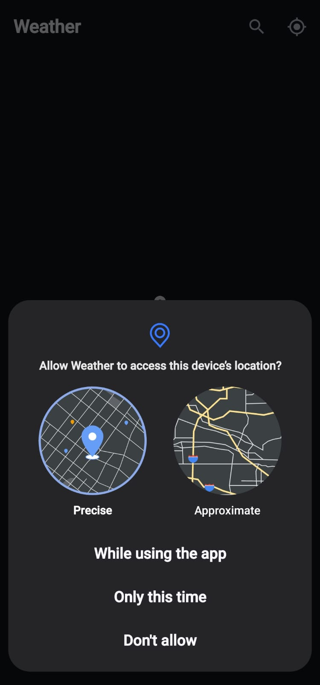
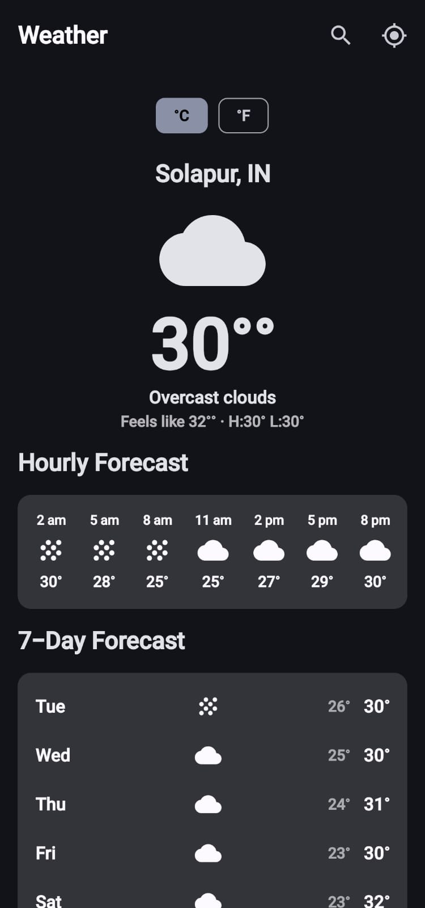
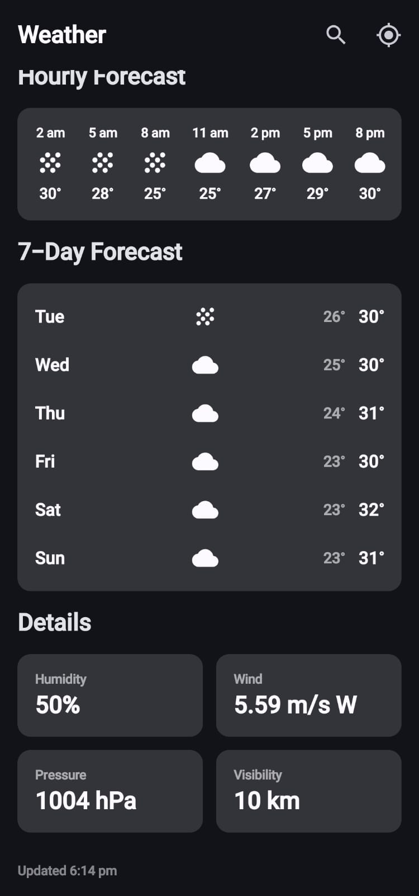
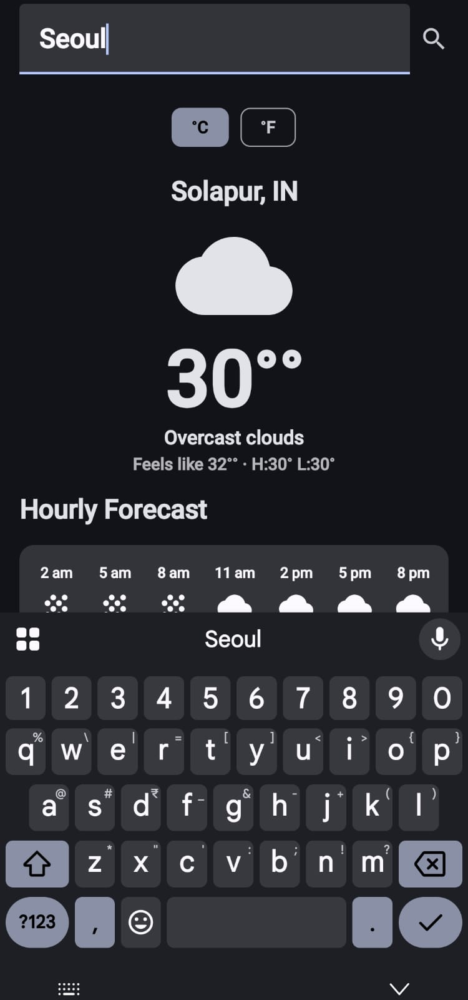
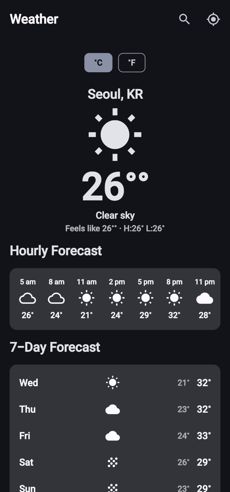

# Weather — Real-Time Android Weather App

A native Android weather app built with **Kotlin** and **Jetpack Compose**, showing live weather for
your current GPS location with automatic background refresh as you move, plus city search,
hourly/daily forecasts, and Celsius/Fahrenheit switching.

<p float="left>





</p>

## Tech stack

| Layer            | Choice                                                                 |
|-------------------|-------------------------------------------------------------------------|
| UI                | Jetpack Compose + Material 3 (dynamic color, dark theme support)       |
| Architecture      | MVVM + Clean Architecture (`data` / `domain` / `presentation`)         |
| DI                | Hilt                                                                     |
| Networking        | Retrofit2 + OkHttp + Gson                                               |
| Location          | Google Play Services `FusedLocationProviderClient` (live updates)      |
| Persistence       | Jetpack DataStore (Preferences) for saved unit setting                 |
| Permissions       | Accompanist Permissions                                                 |
| Weather data      | [OpenWeatherMap](https://openweathermap.org/api) (free tier)           |

## How "real-time" works

`LocationTracker` exposes a `callbackFlow` of location updates from `FusedLocationProviderClient`
using a balanced-power priority. `WeatherViewModel.startLiveTracking()`:

1. Fetches weather immediately for the last-known/current location.
2. Subscribes to the live location Flow and, whenever the device moves more than ~1.5 km
   (`hasMovedSignificantly`), silently re-fetches weather in the background — no manual refresh
   needed, and no error toast is shown for a failed *background* refresh so it never interrupts you.
3. You can also toggle live tracking off (GPS icon in the top bar), pull-to-refresh, or search a
   specific city, which pauses live tracking until you turn it back on.

## Project structure

```
app/src/main/java/com/example/weatherapp/
├── data/
│   ├── remote/            Retrofit service, DTOs, DTO→domain mappers
│   ├── repository/        WeatherRepositoryImpl (network + simple cache)
│   ├── location/          LocationTracker (FusedLocationProviderClient wrapper)
│   └── prefs/              DataStore-backed UserPreferences
├── domain/
│   ├── model/              Clean UI-facing models (CurrentWeather, WeatherBundle, ...)
│   └── repository/        WeatherRepository interface
├── di/                      Hilt modules (Retrofit/OkHttp/Gson wiring)
├── presentation/
│   ├── viewmodel/          WeatherViewModel + WeatherUiState
│   ├── screen/              WeatherScreen (Scaffold, pull-to-refresh, states)
│   └── components/        Reusable Compose pieces (hero, hourly/daily lists, permission gate)
├── ui/theme/                Material3 color scheme, typography
└── util/                    Icon mapping, date/temp formatting, Result wrapper
```

## Setup

1. **Get a free API key** at https://openweathermap.org/api — the Current Weather, 5 Day / 3 Hour
   Forecast, and Geocoding endpoints used here are all on the free tier (60 calls/min).
   New keys can take a few minutes to activate.

2. **Add your key.** Copy `local.properties.example` → `local.properties` in the project root and
   fill in:
   ```properties
   sdk.dir=/path/to/your/Android/sdk
   WEATHER_API_KEY=your_actual_key_here
   ```
   `local.properties` is gitignored, so your key never gets committed. It's injected into the app
   at build time via `BuildConfig.WEATHER_API_KEY`.

3. **Open in Android Studio** (Koala/2024.1+ recommended). The Gradle wrapper jar isn't included
   in this download (binary file) — Android Studio regenerates it automatically on first open/sync,
   or run `gradle wrapper --gradle-version 8.9` once yourself. Then let Gradle sync to pull all
   dependencies automatically.

4. **Run** on a device or emulator with Google Play Services (needed for `FusedLocationProviderClient`).
   Grant the location permission when prompted.

Minimum SDK 26 (Android 8.0), target/compile SDK 34.

## Notes & possible extensions

-The free OpenWeatherMap tier doesn't include the "One Call" API, so daily forecasts are derived 
by aggregating the 3-hour/5-day forecast into per-day min/max. Swap in One Call 3.0 for hourly-for-48h 
and 8-day daily data with a paid plan.

-WorkManager-based periodic background sync (for when the app isn't open), a home-screen widget, and a Room-backed
multi-city cache are natural next additions.
